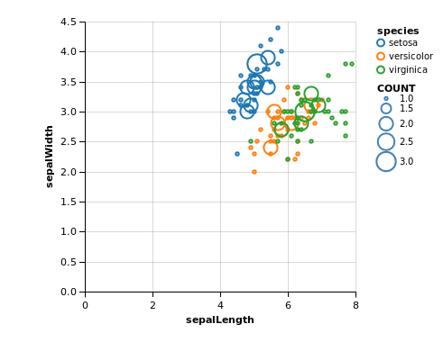

# Interactive Data Visualization (ECL MOS 5.5)

Professeur : [Romain Vuillemot](http://www.ec-lyon.fr/contacts/romain-vuillemot), *LIRS/MI École Centrale de Lyon*

## Question 1 : Dataset Iris

<table border="0">
  <tr>
    <td>
      
    </td>
  </tr>
  <tr>
    <td>
      Visualisation des données Iris avec espèces par couleur, et effectif par taille
    </td>
  </tr>
</table>

## Question 2 : Dataset Cars ? Campaign

* Le dataset us-election fourni n'a pas pu être correctement lu par *PoleStar*. Un dataset alternatif a été choisi.

## Question 3 : Dataset Stocks

*Visualisation des données Stocks en ligne par cours selon le symbole, couleur par symbole* 

<table border="0">
  <tr>
    <td>
      
    </td>
  </tr>
  <tr>
    <td>
      Visualisation des données Stocks par cours selon le symbole, couleur par symbole
    </td>
  </tr>
</table>

*Visualisation des données Stocks en barres par cours groupée par symbole*

Pour cette visualisation, la largeur des barres est aussi fonctions du symbole, pour que les barres d'un symbole ne cachent pas celle d'un autre en se superposant.

<table border="0">
  <tr>
    <td>
      
    </td>
  </tr>
  <tr>
    <td>
      Visualisation des données Stocks par cours selon le symbole groupée par symbole
    </td>
  </tr>
</table>

*Visualisation de l'amplitude des données Stocks et de leur densité*

Pour cette visualisation, nous avons choisi d'afficher pour chaque symbole la répartition de ses prix sur son amplitude, pour voir les zones dans lesquelles les prix se retrouvent le plus fréquemment.

<table border="0">
  <tr>
    <td>
      
    </td>
  </tr>
  <tr>
    <td>
      Visualisation de l'amplitude des données Stocks et de leur densité
    </td>
  </tr>
</table>

1. The goal is to have a first experience with Tableau and build standard charts using a simple dataset.
2. Download and install [Tableau Public](https://public.tableau.com/) (Free) on your machine
3. (Simple) alternative to Tableau: [Polestar](http://vega.github.io/polestar/)
